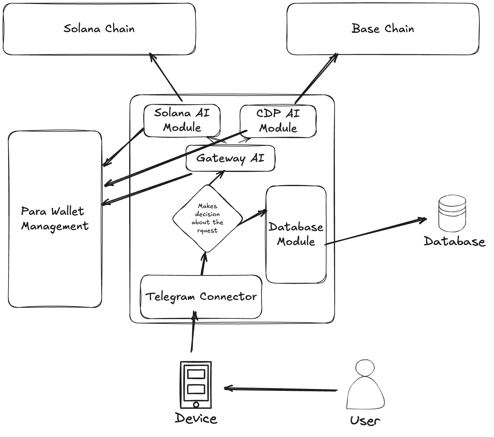

# Project Overview

This project is designed to facilitate interactions with the Solana and Base blockchain networks through a sophisticated AI-driven architecture. The system integrates various modules to handle requests, manage wallets, and interact with users via a Telegram bot. The architecture is modular, allowing for seamless integration and expansion.

## Architecture

The architecture consists of several key components:

- **Solana AI Module**: Handles interactions with the Solana blockchain, including token operations, NFT management, and trading.

- **CDP AI Module**: Manages interactions with the Base chain, focusing on handling transactions and requests using the Coinbase Developer Platform.

- **Gateway AI**: Acts as the central decision-making unit, routing requests to the appropriate module based on the user's needs.

- **Database Module**: Manages data storage and retrieval, ensuring that all interactions are logged and accessible.

- **Telegram Connector**: Facilitates communication between the user and the system through a Telegram bot, allowing users to send requests and receive responses.

- **Para Wallet Management**: Manages user wallets, ensuring secure and efficient handling of transactions.

## File Responsibilities

### Solana Agent Kit

- **`solana-agent-kit/tools/agent/create_image.ts`**
  - Handles image generation using OpenAI's DALL-E model.

- **`solana-agent-kit/actions/agent/createImage.ts`**
  - Defines the action for creating images, including input validation and error handling.

- **`solana-agent-kit/langchain/agent/create_image.ts`**
  - Implements a tool for creating images, integrating with the SolanaAgentKit.

### Agent

- **`agent/agent.ts`**
  - Initializes the agent with tools and language models, setting up the environment for interaction.

- **`agent/cdpAgentTool.ts`**
  - Manages transactions and requests for the Base chain, utilizing the CDP SDK.

### Telegram Bot

- **`src/bot.ts`**
  - Handles incoming messages from Telegram, processes them through the agent, and sends responses back to the user.

### Utilities

- **`solana-agent-kit/utils/AdrenaClient.ts`**
  - Provides utility functions for interacting with external services.

## Future Enhancements

- **Enhanced AI Models**: Integration of more advanced AI models to improve decision-making and interaction capabilities.

- **Expanded Blockchain Support**: Support for additional blockchain networks to broaden the scope of interactions.

- **User Interface Improvements**: Development of a more intuitive user interface for easier interaction with the system.

- **Security Enhancements**: Implementation of advanced security measures to protect user data and transactions.

## Additional Information

For more details about the project, please visit [ai.nexarb.com](https://ai.nexarb.com).
